# Projects Management
![JDK][jdkBadge] <br/>
By [Hamza Es-saady][linkedinURL]

<!-- Logo -->
<div align="center">

</div> <br/>

<!-- Description -->
**Projects Management** is a web application that helps the management of different projects. With Projects Management you can manage **Projects**, **Collaborators**, **Competences** and **Tasks**. Each Project is composed of different Tasks. Each Collaborator can be assigned to Tasks taking into consideration their Competences and a limit work hours (e.g. 8 hours/day). The attribution is made in an equitable manner.

You are free to reuse, copy, modify, and distribute, but you have to give attribution.

## Project Structure & Sub Modules
**Projects Management** uses four **sub-modules** as dependencies :
* [:file_folder: **projectsmanagement-ejb**][ejbURL] : Business Layer (EJB)
* [:file_folder: **projectsmanagement-jpa**][jpaURL] : Persistence Layer (JPA)
* [:file_folder: **projectsmanagement-web**][webURL] : Web Layer
* [:file_folder: **projectsmanagement-app**][appURL] : EAR project

These four sub-modules will be included in the folder **projectsmanagement-master**. 

Here is the relationship between these modules :
<div align="center">
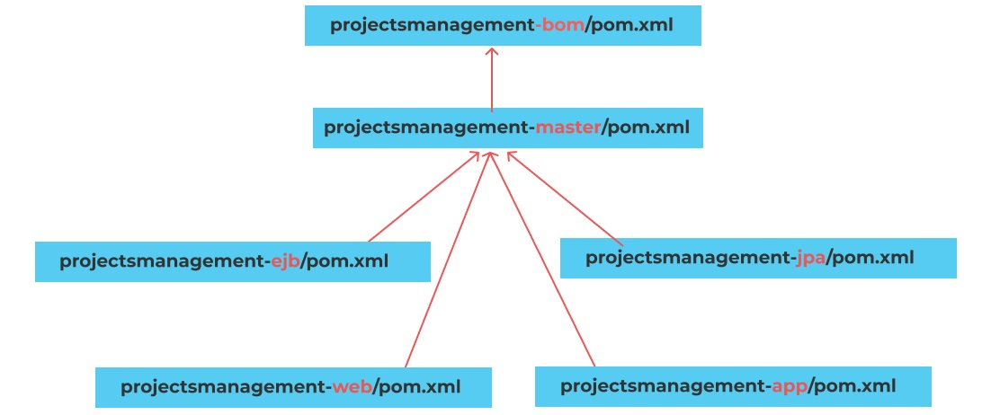
</div> <br/>

## Technologies & Tools
**Projects Management** is created with :
* JavaEE 7.0
* EJB 3.2 (Enterprise Java Bean)
* JPA (Java Persistence API)
* CDI
* Hibernate 5.4.16
* JSF 2.1 (JavaServer Faces) with Mojarra 2.3.2. implementation
* PrimeFaces 8
* JavaEE security
* Maven 2
* GlassFish 5
* MySQL 5

## Installation and configuration

### Database Schema
Run this **[script](./projectsManagement_db.sql)** to create the database. The admin credentials will be inserted also : 
```
  username: master
  password: 123456
```
### Clone the project
Run this command to clone the project along with all the sub-modules :
```
  git clone https://github.com/Kuohamkun/projectsmanagement-bom.git --recursive
```

## Screenshots

### Landing Page
* Authentication : JavaEE Security

<div align="center">
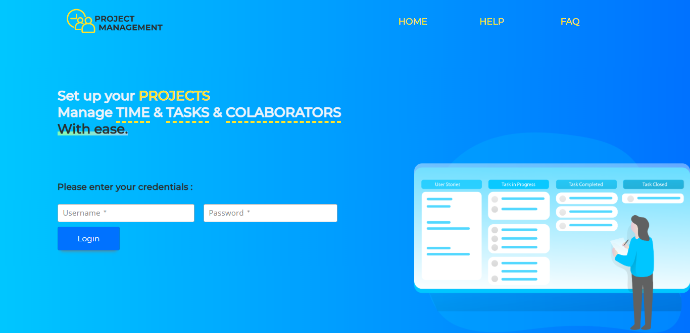
</div> <br/>

### Dashboard
* General overview of Projects, Collaborators, Competences and Tasks
<div align="center">

</div> <br/>

### Collaborators
* List, add, edit and delete collaborators
* Assign/remove competences
<div align="center">
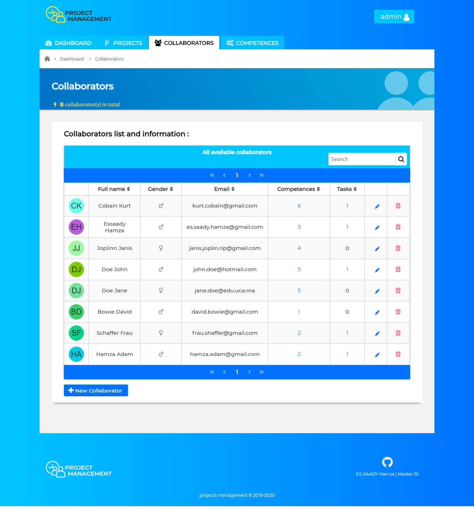
</div> <br/>
<div align="center">
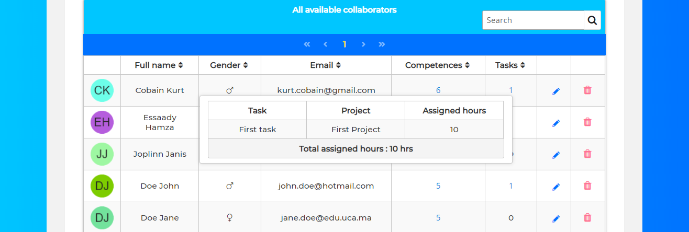
</div> <br/>
<div align="center">
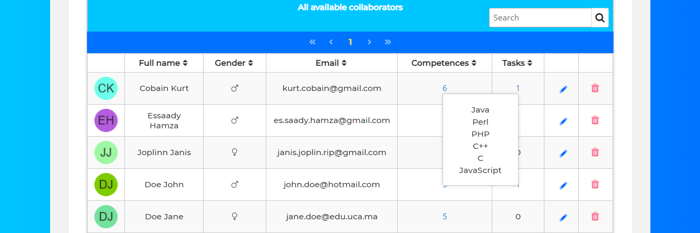
</div> <br/>
<div align="center">

</div> <br/>

### Competences
* List, add, edit and delete competences
* Statistics showing the number of collaborators for each competence 
<div align="center">
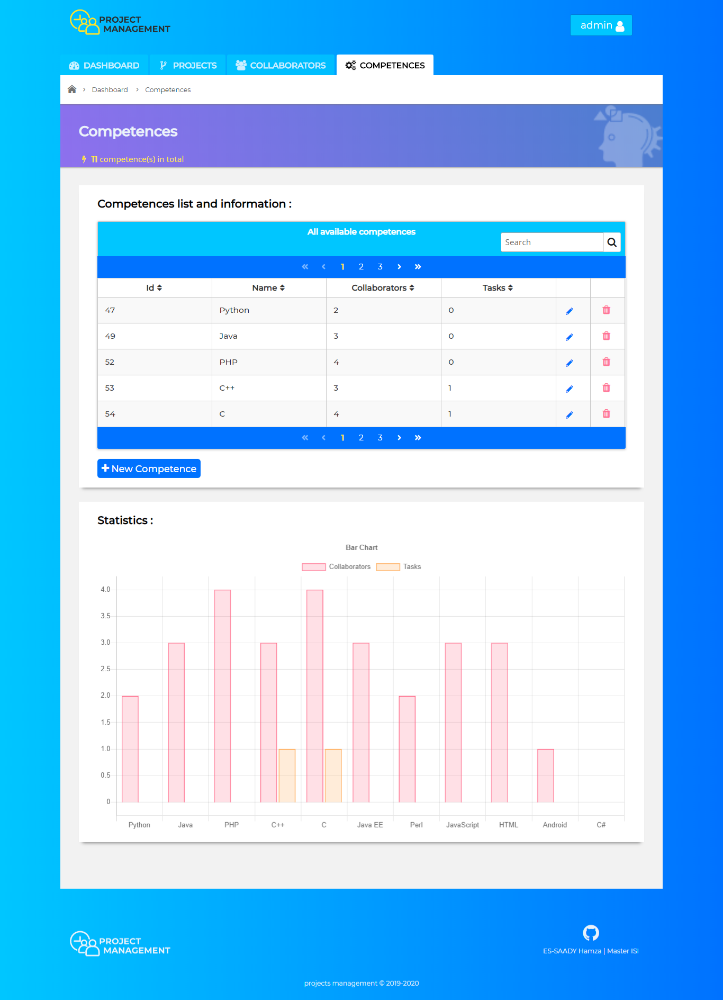
</div> <br/>

### Projects
* List, add, edit and delete projects

Here the creation of projects follows a time allocation rule. The maximum duration in a day is set at 8am, and weekends are disabled.
<div align="center">
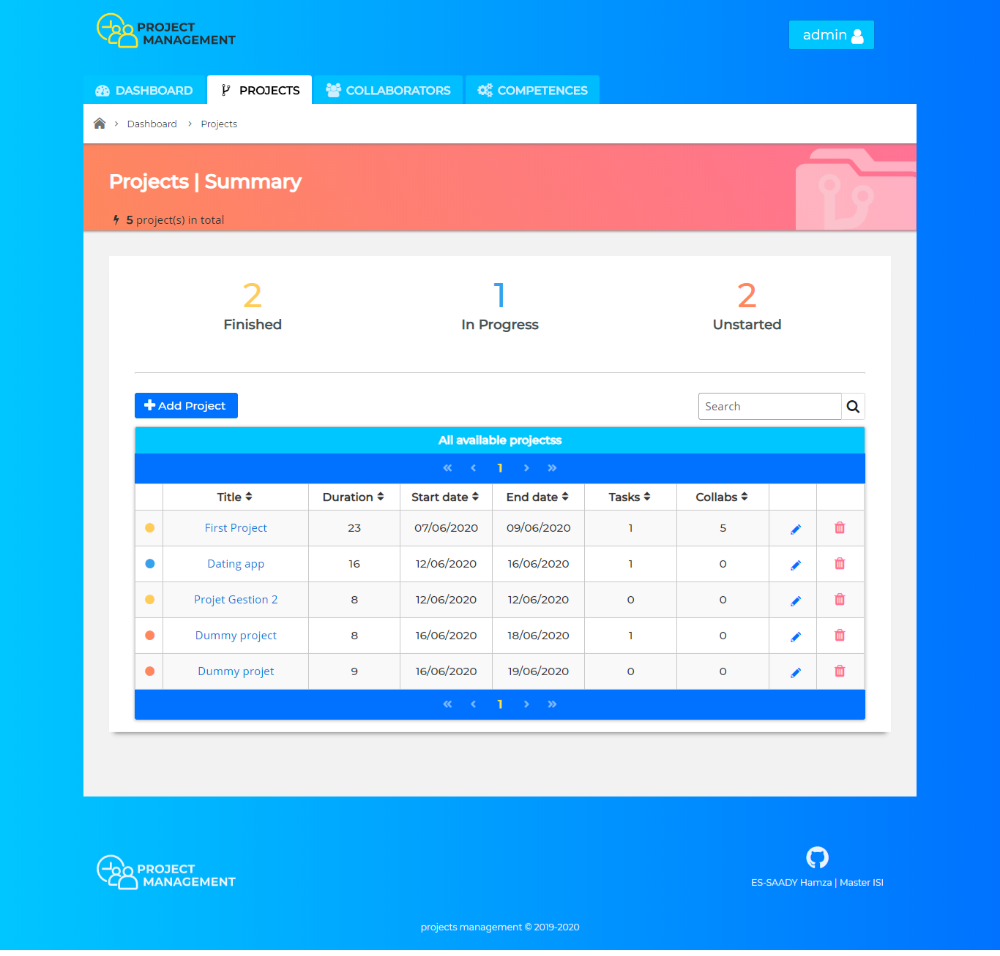
</div> <br/>

### Tasks
* List, add, edit and delete tasks
* Assign/remove tasks competences
* Assign work hours to collaborators in a given task. The attribution is made in an equitable manner.
<div align="center">
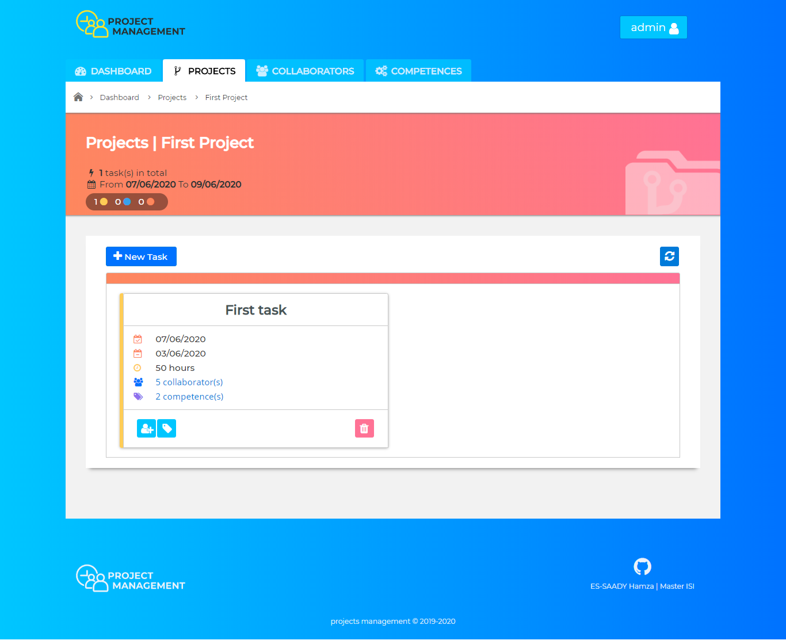
</div> <br/>
<div align="center">
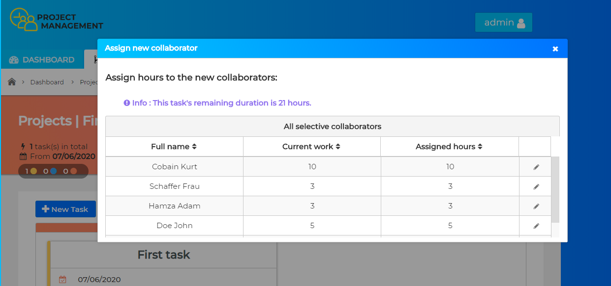
</div> <br/>
<div align="center">
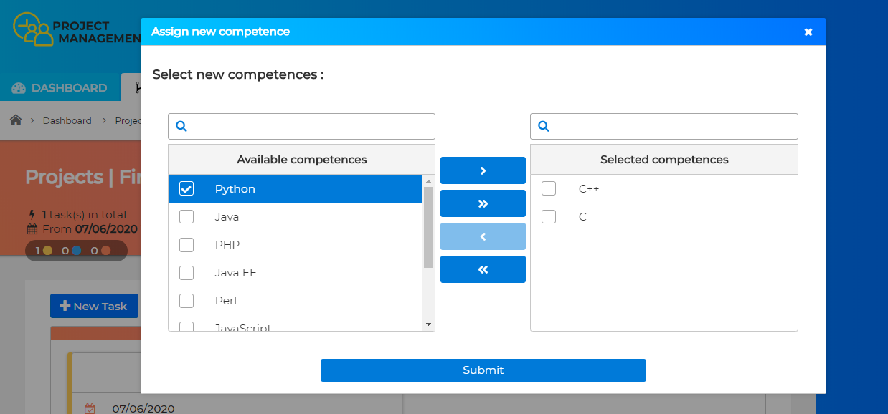
</div> <br/>
<div align="center">
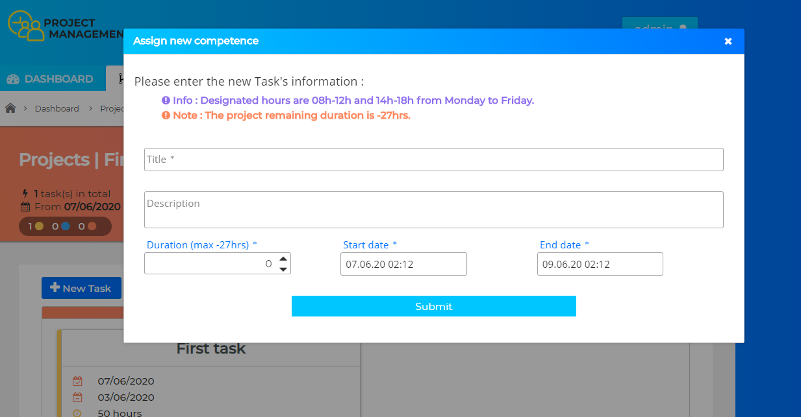
</div> <br/>


<!-- Identifiers --------------------------------------------------------- -->
[linkedinURL]: https://www.linkedin.com/in/essaadyhamza/
[ejbURL]: https://github.com/Kuohamkun/projectsmanagement-ejb
[jpaURL]: https://github.com/Kuohamkun/projectsmanagement-jpa
[webURL]: https://github.com/Kuohamkun/projectsmanagement-web
[appURL]: https://github.com/Kuohamkun/projectsmanagement-application
[jdkBadge]: https://img.shields.io/badge/JDK-1.8-007396?style=flat&logo=java

